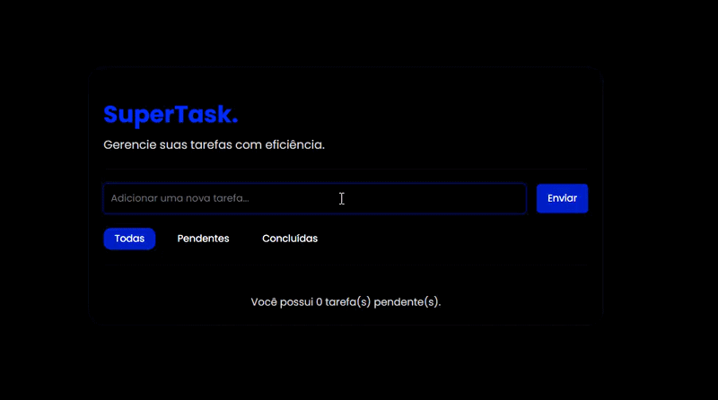

# SuperTask
O SuperTask é uma aplicação de gerenciamento de tarefas (To-Do List) desenvolvida com JavaScript Vanilla.

## 📸 Preview

## Tecnologias Utilizadas
- `HTML5 & CSS3`: Interface responsiva com variáveis CSS e fontes personalizadas.

- `JavaScript (ES6+)`: Uso extensivo de métodos de array (map, filter, find), desestruturação e spread operator.

- `Font Awesome`: Ícones vetoriais para ações de interface.

## Diferenciais Técnicos
- Arquitetura Modular (ESM) através de módulos ES6 (import/export).

- Manipulação de DOM Otimizada com o uso de DocumentFragment.

- Delegação de Eventos otimizando o consumo de memória.

- Persistência Local garantindo que os dados não sejam perdidos ao recarregar a página.

- Filtragem Dinâmica de acordo com o status.
